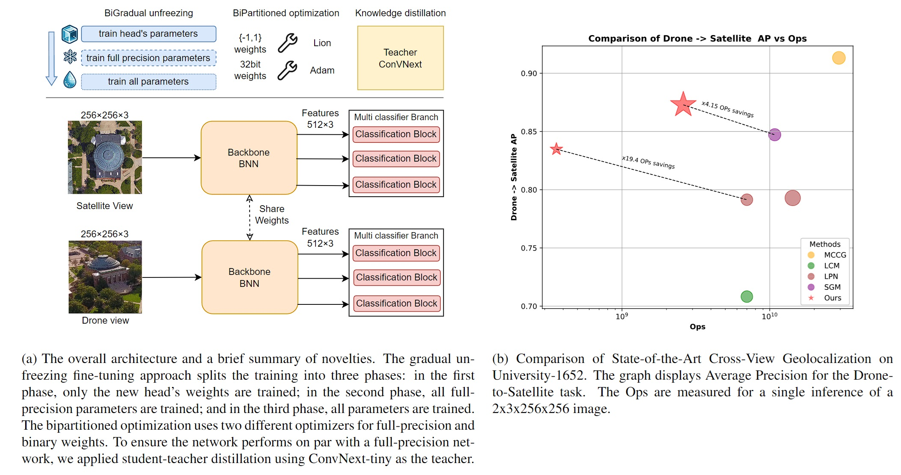

# BiCrossNet: Towards Resource-Efficient Cross-View Geolocalization with Binary Neural Networks

This repository contains the code for BiCrossNet, a novel approach to cross-view geolocalization utilizing Binary Neural Networks (BNNs) to significantly reduce computational complexity while maintaining competitive performance. The key contributions include the development of a bi-gradual unfreezing method to enhance transfer learning, a bi-partitioned optimization strategy to improve training stability, and logit-based knowledge distillation to supplement standard losses.

## Requirements

1. Download the [University-1652](https://github.com/layumi/University1652-Baseline) dataset.
2. Download the [SUES-200](https://github.com/Reza-Zhu/SUES-200-Benchmark) dataset.
3. Configure the environment:
    * Install PyTorch and TorchVision from the [PyTorch](https://pytorch.org/) website.
    * Install the required packages:
      ```shell
      pip install -r requirements.txt
      ```

## Dataset Organization

### University-1652 Dataset
The directory structure of the University-1652 dataset should be as follows:
```
├── University-1652/
│   ├── train/
│       ├── drone/                   /* drone-view training images */
│           ├── 0001
│           ├── 0002
│           ...
│       ├── street/                  /* street-view training images */
│       ├── satellite/               /* satellite-view training images */     
│       ├── google/                  /* noisy street-view training images (collected from Google Image) */
│   ├── test/
│       ├── query_drone/  
│       ├── gallery_drone/  
│       ├── query_street/  
│       ├── gallery_street/ 
│       ├── query_satellite/  
│       ├── gallery_satellite/ 
│       ├── 4K_drone/
```

### SUES-200 Dataset
The directory structure of the SUES-200 dataset should be as follows:
```
├── SUES-200/
│   ├── train/
│       ├── 150/
│           ├── drone/                   /* drone-view training images */
│               ├── 0001
│               ├── 0002
│               ...
│           ├── satellite/               /* satellite-view training images */     
│       ├── 200/                  
│       ├── 250/  
│       ├── 300/  
│   ├── test/
│       ├── 150/  
│           ├── query_drone/  
│           ├── gallery_drone/  
│           ├── query_satellite/  
│           ├── gallery_satellite/ 
│       ├── 200/  
│       ├── 250/  
│       ├── 300/  
```

## Weights of the teacher


2. Download the teacher's model weights and pretrained backbone from [this link](https://drive.google.com/drive/folders/1ZW0s4pz47dlBXlUlyOtr6cv4uQ6AYjXa?usp=drive_link). Extract the files in the main folder.


## Train and Test

We provide scripts to complete BiCrossNet training and testing.

1. Change the `data_dir` and `test_dir` paths in the scripts as needed.
2. To train and evaluate on University-1652, run:
   ```shell
   bash train_and_evaluate_university.sh
   ```

3. To train and evaluate on SUES-200 at different altitudes, run the respective scripts:
   ```shell
   bash train_and_evaluate_sue_150.sh
   ```
   ```shell
   bash train_and_evaluate_sue_200.sh
   ```
   ```shell
   bash train_and_evaluate_sue_250.sh
   ```
   ```shell
   bash train_and_evaluate_sue_300.sh
   ```
## Acknowledgements

We would like to express our gratitude to the following repositories, which made this work possible:

- [Join The High Accuracy Club on ImageNet With A Binary Neural Network Ticket](https://github.com/hpi-xnor/BNext/)
- [MCCG](https://github.com/mode-str/crossview)
- [ReCU: Reviving the Dead Weights in Binary Neural Networks](https://github.com/z-hXu/ReCU)
- [A ConvNet for the 2020s](https://github.com/facebookresearch/ConvNeXt)
- [Lion - Pytorch](https://github.com/lucidrains/lion-pytorch)

## Contact

For any questions or comments, please contact fontana.f@di.uniroma1.it
